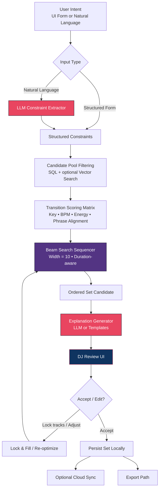
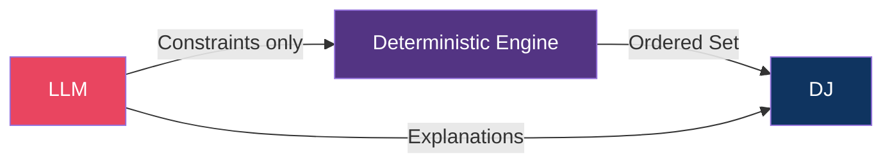

# Hybrid Set Builder Pipeline

LLM understands intent. Beam Search optimizes sequence. DJ stays in control.

```mermaid
flowchart TD
    A[User Intent<br/>UI Form or Natural Language] --> B{Input Type}
    B -->|Natural Language| C[LLM Constraint Extractor]
    B -->|Structured Form| D[Structured Constraints]
    C --> D

    D --> E[Candidate Pool Filtering<br/>SQL + optional Vector Search]
    E --> F[Transition Scoring Matrix<br/>Key • BPM • Energy • Phrase Alignment]
    F --> G[Beam Search Sequencer<br/>Width = 10 • Duration-aware]
    G --> H[Ordered Set Candidate]
    H --> I[Explanation Generator<br/>LLM or Templates]
    I --> J[DJ Review UI]
    
    J --> K{Accept / Edit?}
    K -->|Lock tracks / Adjust| L[Lock & Fill / Re-optimize]
    L --> G
    K -->|Accept| M[Persist Set Locally]
    M --> N[Optional Cloud Sync]
    M --> O[Export Path]

    style C fill:#e94560,stroke:#1a1a2e,color:#fff
    style G fill:#533483,stroke:#1a1a2e,color:#fff
    style I fill:#e94560,stroke:#1a1a2e,color:#fff
    style J fill:#0f3460,stroke:#e94560,color:#fff
```

## Critical Design Rule

```mermaid
flowchart LR
    A[LLM] -->|Constraints only| B[Deterministic Engine]
    B -->|Ordered Set| C[DJ]
    A -->|Explanations| C

    style A fill:#e94560,color:#fff
    style B fill:#533483,color:#fff
    style C fill:#0f3460,color:#fff
```

**The LLM never emits the final ordered tracklist.**
