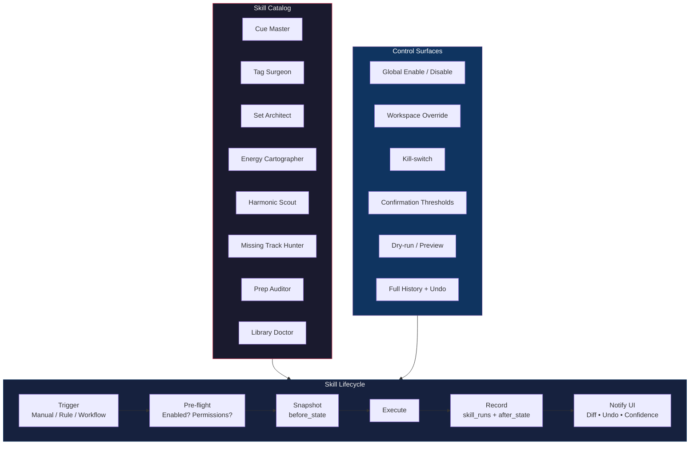

# Skills System

Scoped, reversible, inspectable automation units.

```mermaid
flowchart TD
    subgraph Catalog["Skill Catalog"]
        S1[Cue Master]
        S2[Tag Surgeon]
        S3[Set Architect]
        S4[Energy Cartographer]
        S5[Harmonic Scout]
        S6[Missing Track Hunter]
        S7[Prep Auditor]
        S8[Library Doctor]
    end

    subgraph Lifecycle["Skill Lifecycle"]
        T[Trigger<br/>Manual / Rule / Workflow] --> PF[Pre-flight<br/>Enabled? Permissions?]
        PF --> SNAP[Snapshot<br/>before_state]
        SNAP --> EXEC[Execute]
        EXEC --> REC[Record<br/>skill_runs + after_state]
        REC --> UI[Notify UI<br/>Diff • Undo • Confidence]
    end

    subgraph Controls["Control Surfaces"]
        C1[Global Enable / Disable]
        C2[Workspace Override]
        C3[Kill-switch]
        C4[Confirmation Thresholds]
        C5[Dry-run / Preview]
        C6[Full History + Undo]
    end

    Catalog --> Lifecycle
    Controls --> Lifecycle

    style Catalog fill:#1a1a2e,stroke:#e94560,color:#eee
    style Lifecycle fill:#16213e,stroke:#0f3460,color:#eee
    style Controls fill:#0f3460,stroke:#533483,color:#fff
```

## Automation Rule Pattern

```mermaid
flowchart LR
    A[WHEN<br/>event] --> B[IF<br/>conditions]
    B --> C[THEN<br/>run Skill s]
    
    style A fill:#e94560,color:#fff
    style B fill:#533483,color:#fff
    style C fill:#0f3460,color:#fff
```
