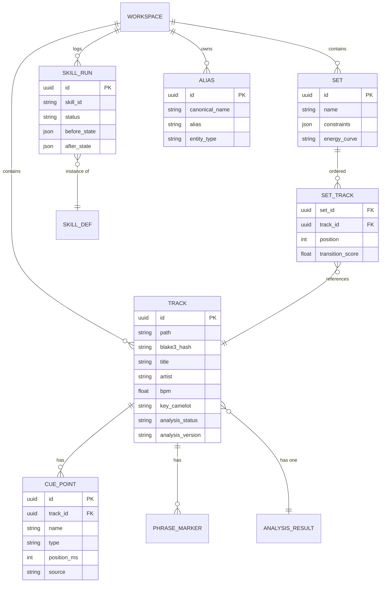
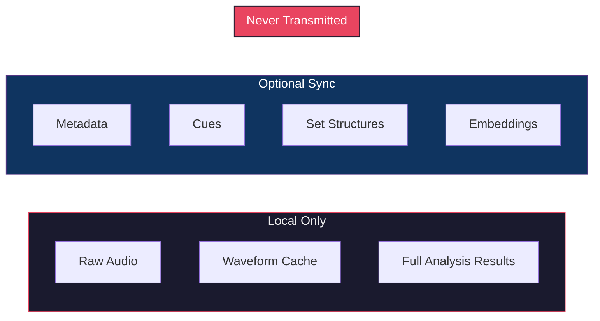

# Data Model (Conceptual)

Local SQLite is source of truth. Cloud holds only opted-in derived data.

```mermaid
erDiagram
    WORKSPACE ||--o{ TRACK : contains
    WORKSPACE ||--o{ SET : contains
    WORKSPACE ||--o{ SKILL_RUN : logs
    WORKSPACE ||--o{ ALIAS : owns

    TRACK ||--o{ CUE_POINT : has
    TRACK ||--o{ PHRASE_MARKER : has
    TRACK }o--|| ANALYSIS_RESULT : "has one"

    SET ||--o{ SET_TRACK : ordered
    SET_TRACK }o--|| TRACK : references

    SKILL_RUN }o--|| SKILL_DEF : "instance of"

    TRACK {
        uuid id PK
        string path
        string blake3_hash
        string title
        string artist
        float bpm
        string key_camelot
        string analysis_status
        string analysis_version
    }

    CUE_POINT {
        uuid id PK
        uuid track_id FK
        string name
        string type
        int position_ms
        string source
    }

    SET {
        uuid id PK
        string name
        json constraints
        string energy_curve
    }

    SET_TRACK {
        uuid set_id FK
        uuid track_id FK
        int position
        float transition_score
    }

    SKILL_RUN {
        uuid id PK
        string skill_id
        string status
        json before_state
        json after_state
    }

    ALIAS {
        uuid id PK
        string canonical_name
        string alias
        string entity_type
    }
```

## Local vs Cloud Boundary

```mermaid
flowchart LR
    subgraph Local["Local Only"]
        A[Raw Audio]
        B[Waveform Cache]
        C[Full Analysis Results]
    end

    subgraph Optional["Optional Sync"]
        D[Metadata]
        E[Cues]
        F[Set Structures]
        G[Embeddings]
    end

    subgraph Never["Never Transmitted"]
        A
        B
    end

    style Local fill:#1a1a2e,stroke:#e94560,color:#eee
    style Optional fill:#0f3460,stroke:#533483,color:#fff
    style Never fill:#e94560,stroke:#1a1a2e,color:#fff
```
