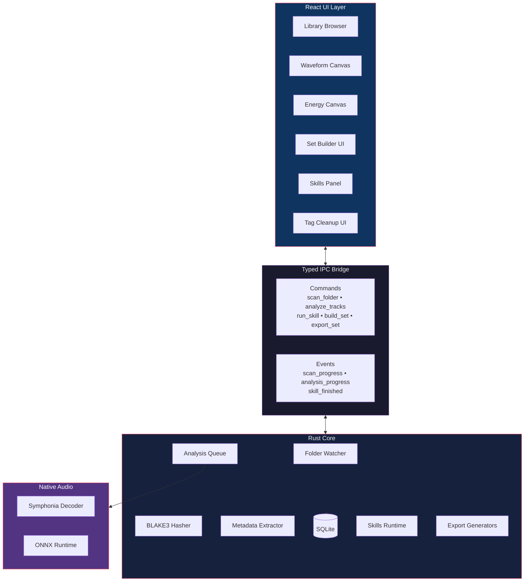
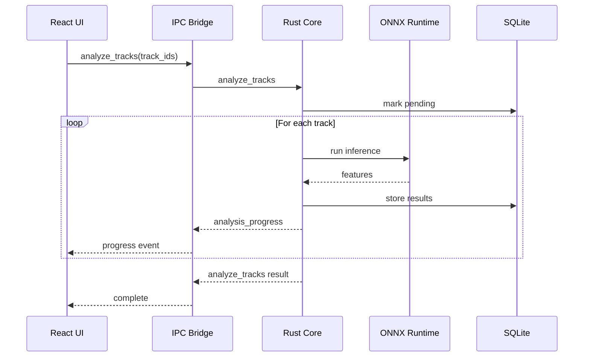

# Component & IPC View

Major desktop components and how they communicate.

```mermaid
flowchart TB
    subgraph React["React UI Layer"]
        LIB[Library Browser]
        WAVE[Waveform Canvas]
        ENERGY[Energy Canvas]
        SETUI[Set Builder UI]
        SKILLS[Skills Panel]
        TAGS[Tag Cleanup UI]
    end

    subgraph IPC["Typed IPC Bridge"]
        CMD[Commands<br/>scan_folder • analyze_tracks<br/>run_skill • build_set • export_set]
        EVT[Events<br/>scan_progress • analysis_progress<br/>skill_finished]
    end

    subgraph Rust["Rust Core"]
        WATCH[Folder Watcher]
        HASH[BLAKE3 Hasher]
        META[Metadata Extractor]
        DB[(SQLite)]
        QUEUE[Analysis Queue]
        SKILLRT[Skills Runtime]
        EXPORT[Export Generators]
    end

    subgraph Native["Native Audio"]
        SYM[Symphonia Decoder]
        ONNX[ONNX Runtime]
    end

    React <--> IPC
    IPC <--> Rust
    QUEUE --> Native
    Rust --> DB

    style React fill:#0f3460,stroke:#e94560,color:#fff
    style IPC fill:#1a1a2e,stroke:#533483,color:#eee
    style Rust fill:#16213e,stroke:#e94560,color:#eee
    style Native fill:#533483,stroke:#e94560,color:#fff
```

## Example Command Flow

```mermaid
sequenceDiagram
    participant UI as React UI
    participant IPC as IPC Bridge
    participant Core as Rust Core
    participant ONNX as ONNX Runtime
    participant DB as SQLite

    UI->>IPC: analyze_tracks(track_ids)
    IPC->>Core: analyze_tracks
    Core->>DB: mark pending
    loop For each track
        Core->>ONNX: run inference
        ONNX-->>Core: features
        Core->>DB: store results
        Core-->>IPC: analysis_progress
        IPC-->>UI: progress event
    end
    Core-->>IPC: analyze_tracks result
    IPC-->>UI: complete
```
