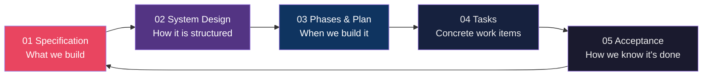
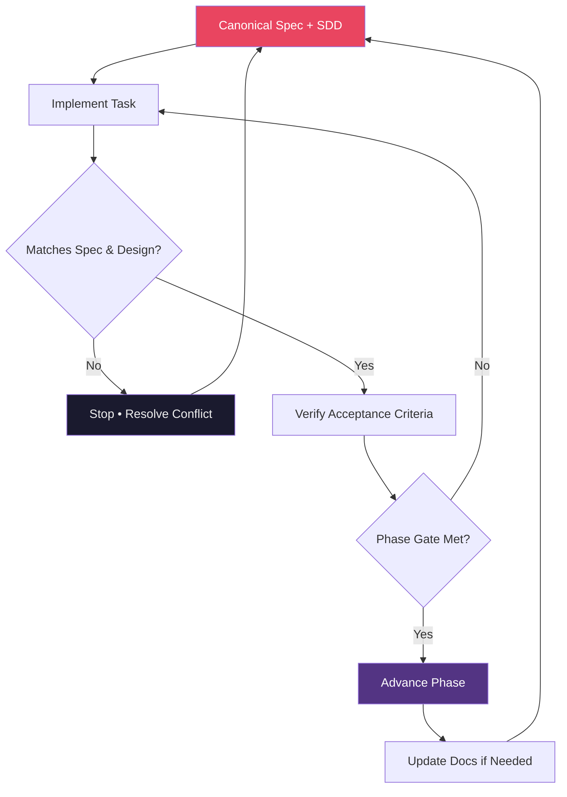
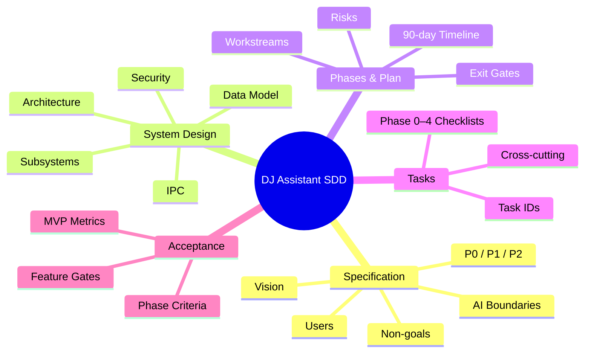

# Specification-Driven Development Flow

How this project turns specification into working software.

```mermaid
flowchart LR
    S[01 Specification<br/>What we build] --> D[02 System Design<br/>How it is structured]
    D --> P[03 Phases & Plan<br/>When we build it]
    P --> T[04 Tasks<br/>Concrete work items]
    T --> A[05 Acceptance<br/>How we know it's done]
    A --> S

    style S fill:#e94560,color:#fff
    style D fill:#533483,color:#fff
    style P fill:#0f3460,color:#fff
    style T fill:#16213e,color:#eee
    style A fill:#1a1a2e,color:#eee
```

## Governance Loop

```mermaid
flowchart TD
    A[Canonical Spec + SDD] --> B[Implement Task]
    B --> C{Matches Spec & Design?}
    C -->|No| D[Stop • Resolve Conflict]
    D --> A
    C -->|Yes| E[Verify Acceptance Criteria]
    E --> F{Phase Gate Met?}
    F -->|No| B
    F -->|Yes| G[Advance Phase]
    G --> H[Update Docs if Needed]
    H --> A

    style A fill:#e94560,color:#fff
    style D fill:#1a1a2e,color:#eee
    style G fill:#533483,color:#fff
```

## Document Map

```mermaid
mindmap
  root((DJ Assistant SDD))
    Specification
      Vision
      Users
      P0 / P1 / P2
      Non-goals
      AI Boundaries
    System Design
      Architecture
      Subsystems
      Data Model
      IPC
      Security
    Phases & Plan
      90-day Timeline
      Workstreams
      Exit Gates
      Risks
    Tasks
      Phase 0–4 Checklists
      Cross-cutting
      Task IDs
    Acceptance
      Phase Criteria
      MVP Metrics
      Feature Gates
```
