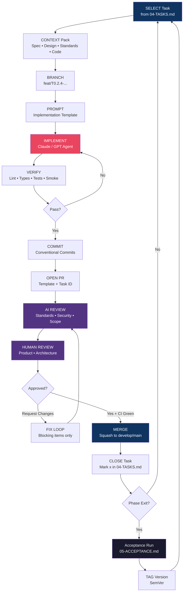
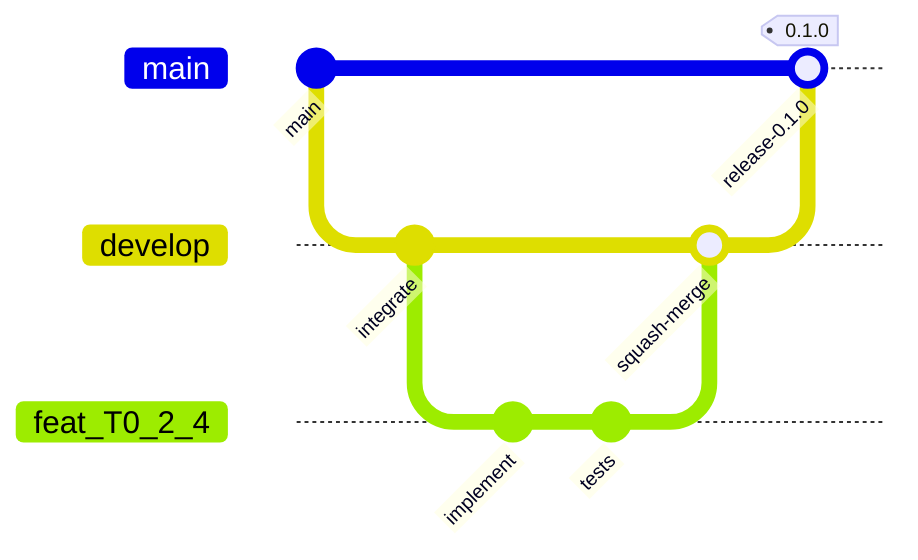
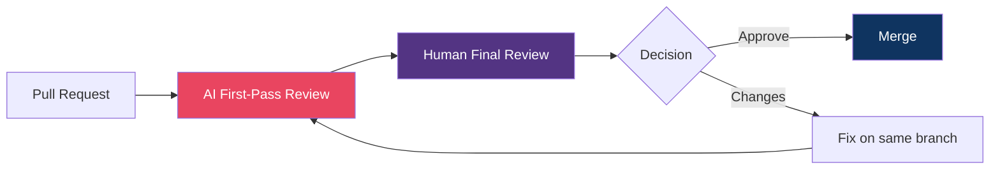

# AI Development Automation Workflow

How Claude / GPT execute work under branch → PR → review → fix → merge discipline.

```mermaid
flowchart TD
    A[SELECT Task<br/>from 04-TASKS.md] --> B[CONTEXT Pack<br/>Spec • Design • Standards • Code]
    B --> C[BRANCH<br/>feat/T0.2.4-...]
    C --> D[PROMPT<br/>Implementation Template]
    D --> E[IMPLEMENT<br/>Claude / GPT Agent]
    E --> F[VERIFY<br/>Lint • Types • Tests • Smoke]
    F --> G{Pass?}
    G -->|No| E
    G -->|Yes| H[COMMIT<br/>Conventional Commits]
    H --> I[OPEN PR<br/>Template + Task ID]
    I --> J[AI REVIEW<br/>Standards • Security • Scope]
    J --> K[HUMAN REVIEW<br/>Product • Architecture]
    K --> L{Approved?}
    L -->|Request Changes| M[FIX LOOP<br/>Blocking items only]
    M --> J
    L -->|Yes + CI Green| N[MERGE<br/>Squash to develop/main]
    N --> O[CLOSE Task<br/>Mark x in 04-TASKS.md]
    O --> P{Phase Exit?}
    P -->|Yes| Q[Acceptance Run<br/>05-ACCEPTANCE.md]
    Q --> R[TAG Version<br/>SemVer]
    P -->|No| A
    R --> A

    style A fill:#0f3460,color:#fff
    style E fill:#e94560,color:#fff
    style J fill:#533483,color:#fff
    style K fill:#533483,color:#fff
    style N fill:#0f3460,color:#fff
    style Q fill:#1a1a2e,color:#eee
```

## Branch Model

```mermaid
gitGraph
    commit id: "main"
    branch develop
    checkout develop
    commit id: "integrate"
    branch feat_T0_2_4
    checkout feat_T0_2_4
    commit id: "implement"
    commit id: "tests"
    checkout develop
    merge feat_T0_2_4 id: "squash-merge"
    checkout main
    merge develop id: "release-0.1.0" tag: "0.1.0"
```

## Review Authority

```mermaid
flowchart LR
    PR[Pull Request] --> AI[AI First-Pass Review]
    AI --> H[Human Final Review]
    H --> D{Decision}
    D -->|Approve| M[Merge]
    D -->|Changes| F[Fix on same branch]
    F --> AI

    style AI fill:#e94560,color:#fff
    style H fill:#533483,color:#fff
    style M fill:#0f3460,color:#fff
```
