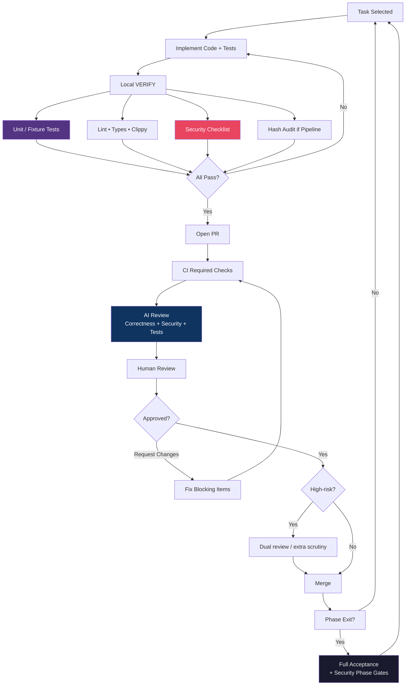
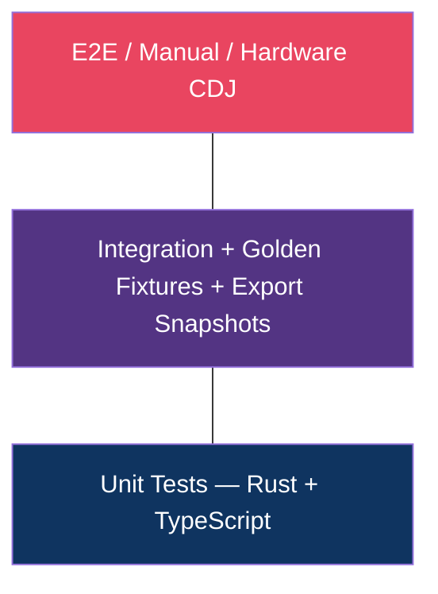
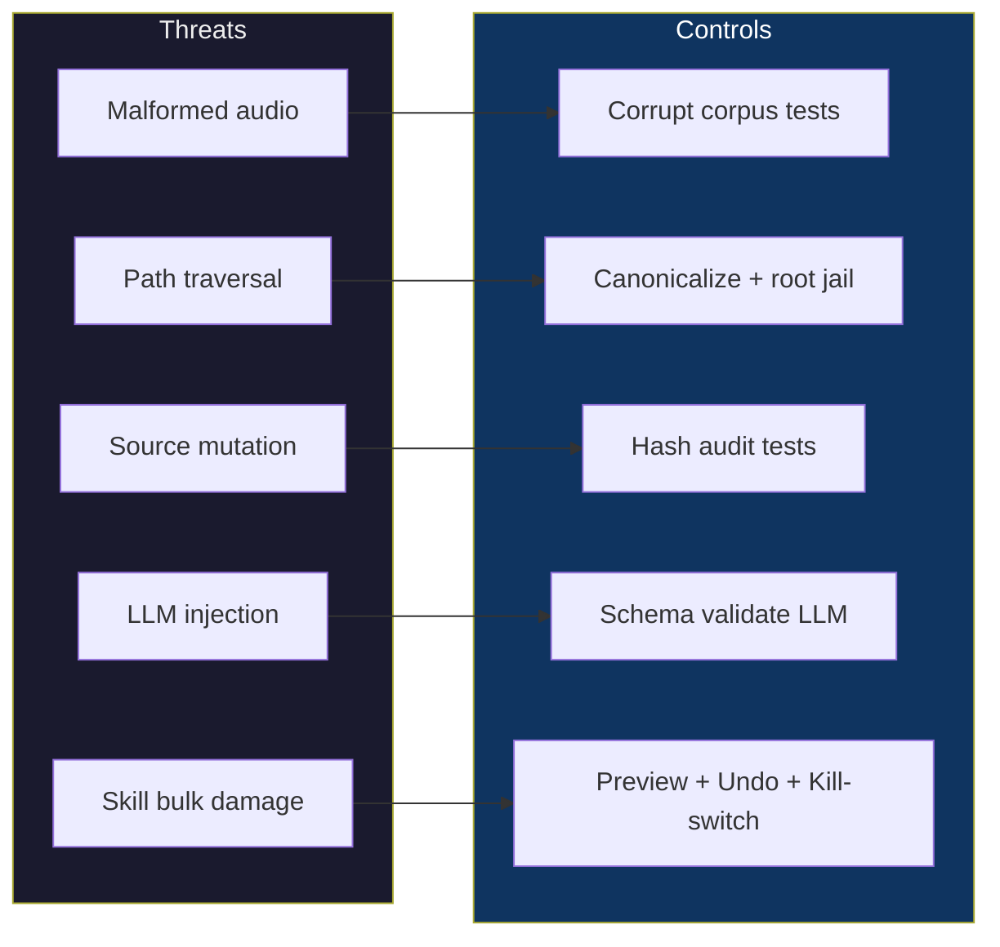

# Testing & Security Gates in the Development Loop

```mermaid
flowchart TD
    A[Task Selected] --> B[Implement Code + Tests]
    B --> C[Local VERIFY]
    C --> C1[Unit / Fixture Tests]
    C --> C2[Lint • Types • Clippy]
    C --> C3[Security Checklist]
    C --> C4[Hash Audit if Pipeline]
    C1 --> D{All Pass?}
    C2 --> D
    C3 --> D
    C4 --> D
    D -->|No| B
    D -->|Yes| E[Open PR]
    E --> F[CI Required Checks]
    F --> G[AI Review<br/>Correctness + Security + Tests]
    G --> H[Human Review]
    H --> I{Approved?}
    I -->|Request Changes| J[Fix Blocking Items]
    J --> F
    I -->|Yes| K{High-risk?}
    K -->|Yes| L[Dual review / extra scrutiny]
    L --> M[Merge]
    K -->|No| M
    M --> N[Phase Exit?]
    N -->|Yes| O[Full Acceptance<br/>+ Security Phase Gates]
    N -->|No| A
    O --> A

    style C3 fill:#e94560,color:#fff
    style C1 fill:#533483,color:#fff
    style G fill:#0f3460,color:#fff
    style O fill:#1a1a2e,color:#eee
```

## Test Pyramid

```mermaid
flowchart TB
    E2E[E2E / Manual / Hardware CDJ]
    INT[Integration + Golden Fixtures + Export Snapshots]
    UNIT[Unit Tests — Rust + TypeScript]

    E2E --- INT
    INT --- UNIT

    style E2E fill:#e94560,color:#fff
    style INT fill:#533483,color:#fff
    style UNIT fill:#0f3460,color:#fff
```

## Security Controls Mapped to Threats

```mermaid
flowchart LR
    subgraph Threats
        T1[Malformed audio]
        T2[Path traversal]
        T3[Source mutation]
        T4[LLM injection]
        T5[Skill bulk damage]
    end

    subgraph Controls
        C1[Corrupt corpus tests]
        C2[Canonicalize + root jail]
        C3[Hash audit tests]
        C4[Schema validate LLM]
        C5[Preview + Undo + Kill-switch]
    end

    T1 --> C1
    T2 --> C2
    T3 --> C3
    T4 --> C4
    T5 --> C5

    style Threats fill:#1a1a2e,color:#eee
    style Controls fill:#0f3460,color:#fff
```
