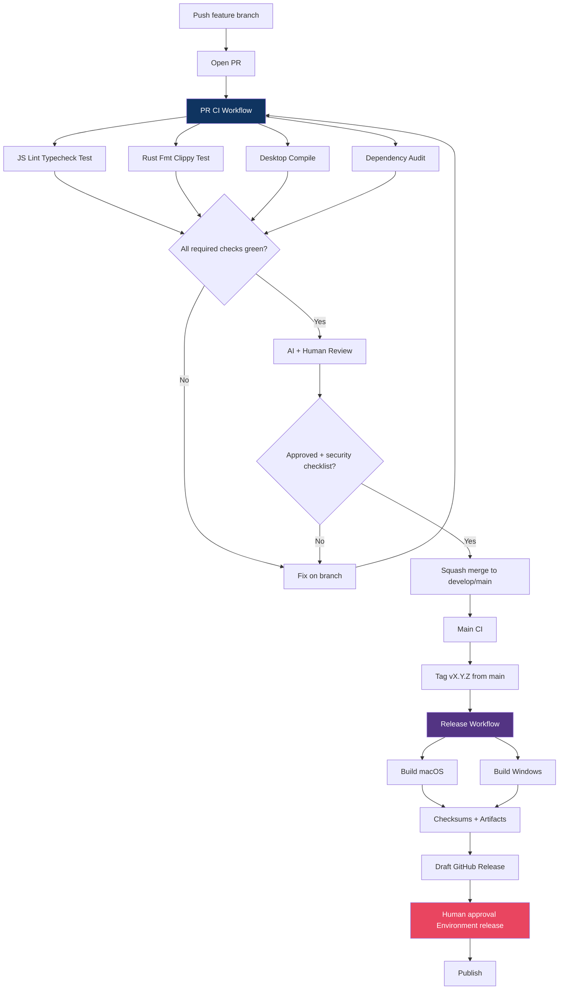
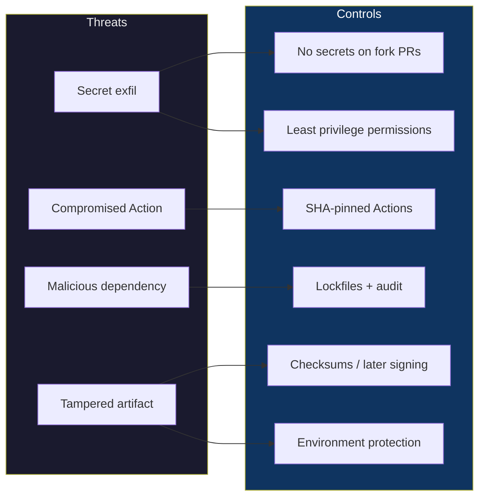
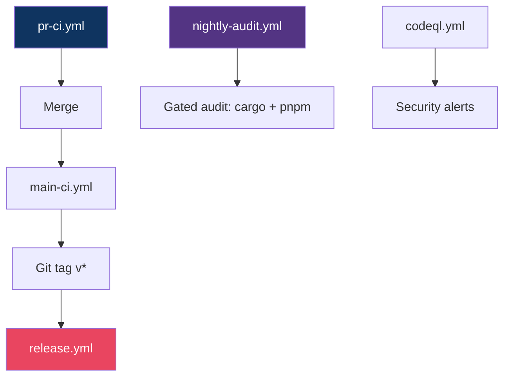

# CI/CD Pipeline Diagrams

## PR → Merge → Release Flow

```mermaid
flowchart TD
    A[Push feature branch] --> B[Open PR]
    B --> C[PR CI Workflow]
    C --> C1[JS Lint Typecheck Test]
    C --> C2[Rust Fmt Clippy Test]
    C --> C3[Desktop Compile]
    C --> C4[Dependency Audit]
    C1 --> D{All required checks green?}
    C2 --> D
    C3 --> D
    C4 --> D
    D -->|No| E[Fix on branch]
    E --> C
    D -->|Yes| F[AI + Human Review]
    F --> G{Approved + security checklist?}
    G -->|No| E
    G -->|Yes| H[Squash merge to develop/main]
    H --> I[Main CI]
    I --> J[Tag vX.Y.Z from main]
    J --> K[Release Workflow]
    K --> K1[Build macOS]
    K --> K2[Build Windows]
    K1 --> L[Checksums + Artifacts]
    K2 --> L
    L --> M[Draft GitHub Release]
    M --> N[Human approval Environment release]
    N --> O[Publish]

    style C fill:#0f3460,color:#fff
    style K fill:#533483,color:#fff
    style N fill:#e94560,color:#fff
```

## Pipeline Security Controls

```mermaid
flowchart LR
    subgraph Controls
        P[Least privilege permissions]
        S[SHA-pinned Actions]
        E[Environment protection]
        L[Lockfiles + audit]
        F[No secrets on fork PRs]
        C[Checksums / later signing]
    end

    subgraph Threats
        T1[Secret exfil]
        T2[Compromised Action]
        T3[Malicious dependency]
        T4[Tampered artifact]
    end

    T1 --> F
    T1 --> P
    T2 --> S
    T3 --> L
    T4 --> C
    T4 --> E

    style Controls fill:#0f3460,color:#fff
    style Threats fill:#1a1a2e,color:#eee
```

## Workflow Map

```mermaid
flowchart TB
    PR[pr-ci.yml] --> M[Merge]
    M --> MAIN[main-ci.yml]
    MAIN --> TAG[Git tag v*]
    TAG --> REL[release.yml]
    SCH[nightly-audit.yml] --> AUDIT[Gated audit: cargo + pnpm]
    CQ[codeql.yml] --> SARIF[Security alerts]

    style PR fill:#0f3460,color:#fff
    style REL fill:#e94560,color:#fff
    style SCH fill:#533483,color:#fff
```
